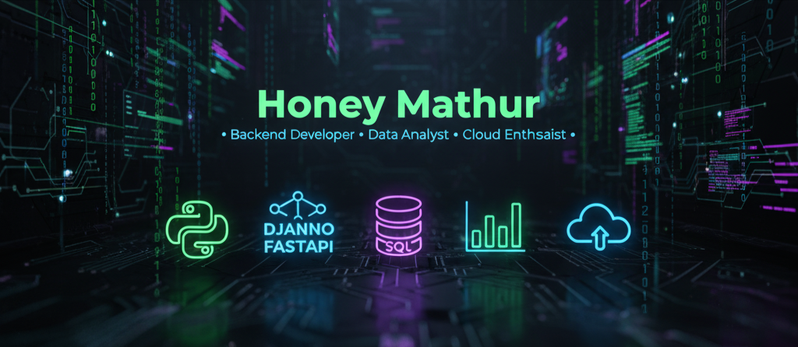

# Hi 👋, I'm Honey Mathur

🚀 **Backend Developer | Data Analyst | Aspiring Data Scientist** 

- 🌱 Learning **Django, FastAPI, and Cloud basics**
- 💬 Ask me about **Python, Data Analysis, Backend Development, Asp.Net**
- 📫 Reach me at: honeyherambmathur@gmail.com  

---

## 🛠️ Skills  

**Languages & Frameworks**  
- Python (Django, Flask, Pandas, NumPy, Scikit-learn)  
- C# (ASP.NET Core)  
- SQL (MySQL, SQLite, Entity Framework)  

**Core Concepts**  
- REST APIs, MVC Architecture  
- Machine Learning, Data Visualization  
- Statistics, Automation  

**Tools & Platforms**  
- Git, Jupyter Notebook, VS Code, Visual Studio, Microsoft Office   

---

### 💼 Professional Experience
- **Wipro Limited, Bengaluru** — *Associate Software Engineer*  
  📅 Dec 2022 – Mar 2025
  *Backend Engineer* | *2+ years of experience* 
  - Developed backend solutions using **Python (Django, Flask)** and **ASP.NET Core** for workflow automation and infotainment testing.  
  - Automated processes with **Python/Bash scripting, AI, and ML**, achieving up to **40% manual effort reduction**.  
  - Designed and validated **CSV/Log file scripts** to improve bug detection accuracy.  
  - Built workflow optimization tools leading to a **30% efficiency boost**.  
  - Worked on **database design (Entity Framework, MySQL, SQLite)** with **Dependency Injection**.  
  - Collaborated with cross-functional teams (5–15 members) to deliver end-to-end solutions for clients like **Ford Motors, Intel, and Hitachi Energy**.    

---

### 📊 GitHub Stats

---

### 🔗 Connect with me

 

📧 honeyherambmathur@gmail.com | 🌐 [Portfolio](https://honeyherambmathur.github.io)  
🔗 [LinkedIn](https://linkedin.com/in/honey-mathur-a8120a16a) • [GitHub](https://github.com/honeyherambmathur)  

---

✨ *Exploring the intersections of Data, Backend Systems, and AI to build impactful solutions.*  

